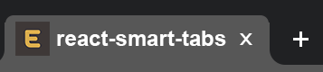
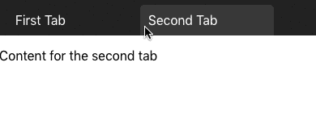
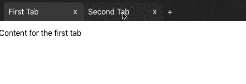
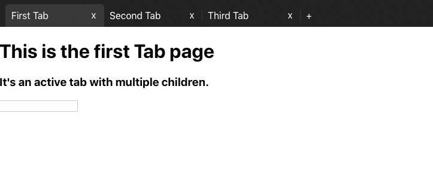

> A simple to use tab system built with react.

[![NPM Version][npm-image]][npm-url] [![Downloads Stats][npm-downloads]][npm-url]

## Description
[react-smart-tabs](https://github.com/EvoluxBR/react-smart-tabs/) is an intuitive tab system built with react, inspired by chrome's tab functionality.

They're simple to use both as a developer and as a user, and take care of all the tab handling logic, so all you need to care about is what components to display.

### Features
- Option to allow tabs to be added
- Option to allow tabs to be closed
- Option to allow tabs to be reordered via drag-and-drop
- Tab nesting
- Data Persistence

## Usage example

### Most basic example. Static Tab Bar with predefined tabs:



```JavaScript
import React from 'react';
import { Tab, TabBar } from 'react-smart-tabs';
//This is our default CSS. Feel free to make your own.
import 'react-smart-tabs/dist/bundle.css';

const App = () => (
  <div className="App">
    <TabBar>
      <Tab id='YourTabId1' text="First Tab">
        <div>
          <p>
            Content for the first tab
          </p>
        </div>
      </Tab>
      <Tab id='YourTabId2' text="Second Tab">
        <div>
          <p>
            Content for the second tab
          </p>
        </div>
      </Tab>
    </TabBar>
  </div>
);

export default App;
```

### Medium example. Tab Bar that allows the user to create new tabs, close existing tabs, and reorder them by via drag-and-drop:




```JavaScript
import React from 'react';
import { Tab, TabBar } from 'react-smart-tabs';
import 'react-smart-tabs/dist/bundle.css'; //This is our default CSS. Feel free to make your own.

const App = () => {
  let dumbId = 0; // Use UUID, or something smarter. This is just an example.

  // This is what the function passed to newTab should look like.
  const AddNewTab = () => {
    // You can customize this however you want.
    dumbId++
    return (
      <Tab id={dumbId} text="New Tab">
        <h1>
          This is a brand new tab. Imagine the possibilities.
        </h1>
      </Tab>
    )
  }

  return (
    <div className="App">
      <TabBar
        newTab={AddNewTab} // Function that returns a <Tab>
        closeable // Allows the user to close tabs
        reorderable // Allows the user to reorder tabs via drag-and-drop
      >
        <Tab id='YourTabId1' text="First Tab">
          <div>
            <p>
              Content for the first tab
            </p>
          </div>
        </Tab>
        <Tab id='YourTabId2' text="Second Tab">
          <div>
            <p>
              Content for the second tab
            </p>
          </div>
        </Tab>
      </TabBar>
    </div>
  );
}

export default App;
```


<details>
  <summary>And here's a <strong>more complex</strong>, detailed example of all the react-smart-tabs functionalities, including nesting tabs (click to collapse)</summary>




```JavaScript
import React from 'react';
import { Tab, TabBar } from 'react-smart-tabs';
//This is our default CSS. Feel free to make your own.
import 'react-smart-tabs/dist/bundle.css';

// Here you can see a Component with a static tab bar within.
const SecondTabPage = () => (
  <div>
    <h1>
      Second tab w/ static subtabs
    </h1>
    <TabBar>
      <Tab id='yourSubTabId1' text="subtab1">
        <h3>
          subtab contents 1
        </h3>
      </Tab>
      <Tab id='yourSubTabId2' text="subtab2">
        <h3>
          subtab contents 2
        </h3>
      </Tab>
      <Tab id='yourSubTabId3' text="subtab3">
        <h3>
          subtab contents 3
        </h3>
        <input/>
      </Tab>
    </TabBar>
  </div>
)

// And here's a simple component with a form
const ThirdTabPage = () => (
  <div>
    <h1>
      Third tab
    </h1>
    <form className='frm'>
      <h1>
        Form inside the third tab.
      </h1>
      <p>
        Notice that it doesnt lose the input content.
      </p>
      <p>
        Name
      </p>
      <input/>
      <p>
        Surname
      </p>
      <input/>
      <p>
        Adress
      </p>
      <input/>
      <p>
        Telephone
      </p>
      <input/>
    </form>
  </div>
)
function App() {
  let dumbId = 0; // Use UUID to make your IDs. This is just a quick, dumb example.

  const createNewTab = () => {
    // This is what the function passed to newTab should look like.
    // You can customize this however you want.
    dumbId++
    return (
      <Tab id={dumbId} text="Newly Added Tab">
        This is a newly created tab
      </Tab>
    )
  }

  return (
    <div className="App">
      <TabBar
        newTab={createNewTab} // Allows you to add new tabs
        reorderable // Defines if you can reorder the tabs by drag and drop
        closeable // Defines if you can close tabs
      >
        <Tab
          id='YourTabId1' // An ID so you can more easily identify the tabs
          text="First Tab" // The text that will display in the tab bar
          active // Decides if this tab is the active one when you mount
        >
          <h1>This is the first Tab page</h1>
          <p>Its an active tab with multiple children.</p>
          <input/>
        </Tab>
        <Tab id='YourTabId2' text="Second Tab">
          <SecondTabPage/>
        </Tab>
        <Tab id='YourTabId3' text="Third Tab">
          <ThirdTabPage/>
        </Tab>
      </TabBar>
    </div>
  );
}

export default App;
```
</details>


## Installation

Install the lib as a dependency
```sh
npm install --save react-smart-tabs
```

Then import and use them like the demos above.
```JavaScript
import { Tab, TabBar } from 'react-smart-tabs';
//This is our default CSS. You can use it or make your own.
import 'react-smart-tabs/dist/bundle.css';

```


## Release History

* 0.0.14
    * FIX: Fixed the NPM bundle so it's lighter.


## Want to contribute?

Follow these steps:
0. Check the open issues. Assign one to yourself or create one.
1. Fork the repository (<https://github.com/EvoluxBR/react-smart-tabs/fork>)
2. Create your branch (`git checkout -b feature/fooBar`) within your forked version
3. Make your feature :D
4. Commit your changes (`git commit -am 'Add some fooBar'`)
4. Push to the branch (`git push origin feature/fooBar`)
5. Create a new Pull Request and wait for feedback.

Distributed under the MIT license. See ``LICENSE`` for more information.

<!--
Markdown link & img dfn's
Use these links to get the badges:
 - https://badge.fury.io/for/js/react-smart-tabs
 - https://shields.io/category/downloads

-->
[npm-image]: https://badge.fury.io/js/react-smart-tabs.svg
[npm-url]: https://www.npmjs.com/package/react-smart-tabs
[npm-downloads]: https://img.shields.io/npm/dt/react-smart-tabs?label=npm%20downloads&style=flat-square
[wiki]: https://github.com/EvoluxBR/react-smart-tabs/wiki
