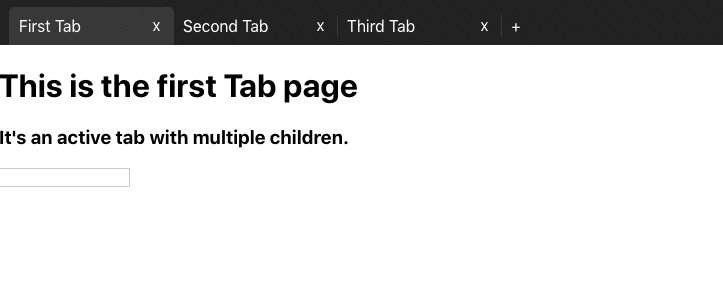

# react-smart-tabs
> A simple to use tab system built with react.

[![NPM Version][npm-image]][npm-url] [![Downloads Stats][npm-downloads]][npm-url]

This Tab system was inspired by Chrome's tab functionality. It's very intuitive and works as you'd expect.

You can use them as static tabs that just display what you want, or you can allow the user to create new tabs and/or close them. You can also choose if reordering the tabs via drag-and-drop is something you'd like.

Finally, all state persists while the tabs are mounted, so you can change tabs without losing input values. All this logic is already implemented in the package, so you don't need to worry about it. It's meant to be simple to use.




## Installation

```sh
npm install --save react-smart-tabs
```


## Usage example

Basically, you call *TabBar* passing it these props, depending on what you want the behavior to be:
 - *newTab=*{functionThatReturnsTab} - Pass this if you want to allow the user to create new tabs.
- *reorderable* - Pass this if you want the user to reorder the tabs via drag-and-drop
- *closeable* - Pass this if you want the user to be able to close tabs.

Then, as children of *TabBar*, you can call however many <Tab> components as you want, including none at all.

Each *Tab* component can receive up to 3 props:
  - *id* - Use a UUID or something similar, so you can diferentiate between them.
  - *text* - This is the title text that will display at the top, on the TabBar
  - *active* - Pass this to the one tab you want to be active onLoad.

Finally, as children of the *Tab* components, you can pass the page you want to render. These can be multiple children, or a single component. You can even nest another TabBar inside it.

<details>
  <summary>Here's a very simple, basic example</summary>

Here you can see an example of a simple, static tab bar.

```JavaScript
import React from 'react';
import { Tab, TabBar } from 'react-smart-tabs';
import 'react-smart-tabs/dist/bundle.css'; //This is our default CSS. Feel free to make your own.

function App() {

  return (
    <div className="App">
      <TabBar>
        <Tab id='YourTabId1' text="First Tab">
          <h1>This is the first Tab page</h1>
          <p>Its an active tab with multiple children.</p>
          <input/>
        </Tab>
        <Tab id='YourTabId2' text="Second Tab">
          <h1>This is the second Tab page</h1>
        </Tab>
        <Tab id='YourTabId3' text="Third Tab">
          <h1>This is the third Tab page</h1>
        </Tab>
      </TabBar>
    </div>
  );
}

export default App;
```
</details>
<details>
  <summary>And here's a more complete one</summary>

Here you can see a more complete, detailed example of react-smart-tabs functionality

```JavaScript
import React from 'react';
import { Tab, TabBar } from 'react-smart-tabs';
import 'react-smart-tabs/dist/bundle.css'; //This is our default CSS. Feel free to make your own.

const SecondTabPage = () => (
  <div>
    <h1>
      Second tab w/ static subtabs
    </h1>
    <TabBar>
      <Tab id='yourSubTabId1' text="subtab1">
        <h3>
          subtab contents 1
        </h3>
      </Tab>
      <Tab id='yourSubTabId2' text="subtab2">
        <h3>
          subtab contents 2
        </h3>
      </Tab>
      <Tab id='yourSubTabId3' text="subtab3">
        <h3>
          subtab contents 3
        </h3>
        <input/>
      </Tab>
    </TabBar>
  </div>
)

const ThirdTabPage = () => (
  <div>
    <h1>
      Third tab
    </h1>
    <form className='frm'>
      <h1>
        Form inside the third tab.
      </h1>
      <p>
        Notice that it doesnt lose the input content.
      </p>
      <p>
        Name
      </p>
      <input/>
      <p>
        Surname
      </p>
      <input/>
      <p>
        Adress
      </p>
      <input/>
      <p>
        Telephone
      </p>
      <input/>
    </form>
  </div>
)
function App() {
  let dumbId = 0; // Use UUID to make your IDs. This is just a quick, dumb example.

  const createNewTab = () => {
    // This is what the function passed to newTab should look like.
    // You can customize this however you want.
    dumbId++
    return (
      <Tab id={dumbId} text="Newly Added Tab">
        This is a newly created tab
      </Tab>
    )
  }

  return (
    <div className="App">
      <TabBar
        newTab={createNewTab}
        reorderable // Defines if you can reorder the tabs by drag and drop
        closeable // Defines if you can close tabs
      >
        <Tab
          id='YourTabId1' // An ID so you can more easily identify the tabs
          text="First Tab" // The text that will display in the tab bar
          active // Decides if this tab is the active one when you mount
        >
          <h1>This is the first Tab page</h1>
          <p>Its an active tab with multiple children.</p>
          <input/>
        </Tab>
        <Tab id='YourTabId2' text="Second Tab">
          <SecondTabPage/>
        </Tab>
        <Tab id='YourTabId3' text="Third Tab">
          <ThirdTabPage/>
        </Tab>
      </TabBar>
    </div>
  );
}

export default App;
```
</details>


## Release History

* 0.0.14
    * FIX: Fixed the NPM bundle so it's lighter.


## Want to contribute?

Follow these steps:
0. Check the open issues. Assign one to yourself or create one.
1. Fork the repository (<https://github.com/EvoluxBR/react-smart-tabs/fork>)
2. Create your branch (`git checkout -b feature/fooBar`) within your forked version
3. Make your feature :D
4. Commit your changes (`git commit -am 'Add some fooBar'`)
4. Push to the branch (`git push origin feature/fooBar`)
5. Create a new Pull Request and wait for feedback.

Distributed under the MIT license. See ``LICENSE`` for more information.

<!--
Markdown link & img dfn's
Use these links to get the badges:
 - https://badge.fury.io/for/js/react-smart-tabs
 - https://shields.io/category/downloads

-->
[npm-image]: https://badge.fury.io/js/react-smart-tabs.svg
[npm-url]: https://www.npmjs.com/package/react-smart-tabs
[npm-downloads]: https://img.shields.io/npm/dt/react-smart-tabs?label=npm%20downloads&style=flat-square
[wiki]: https://github.com/EvoluxBR/react-smart-tabs/wiki
